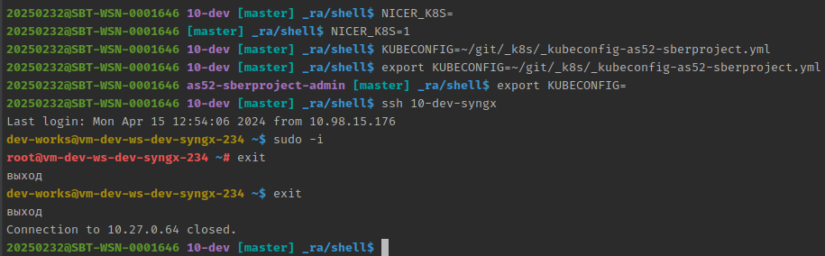

# NICER-BASH-PROMPT

Скрипт для улучшения ПРОМПТа в BASH:

* Меняет цвет пары "ЛОГИН@ХОСТ"
* Сокращает путь до текущей папки двумя уровнями
* Сокращает TITLE окна Терминала
* При нахождении в папке гит-репы - отображает название текущей гит-ветки
* **(DEV)** При наличии kube-config и включенной переменной `NICER_K8S` - отображает текущий `k8s-context`



* `nicer-bash-prompt_dev.sh` - вариант для машины разработчика
* `nicer-bash-prompt_server.sh` - вариант для сервера

## Установка

Для работы `nicer-bash-promtp.sh` достаточно добавить загрузку скрипта в `~/.bashrc` (для одного пользователя),
либо в обще-системный профиль `bashrc` :

### OS-wide

в файле `/etc/bashrc` или `/etc/bash.bashrc` добавить строки для загрузки скриптов из папки `/etc/bashrc.d`:

```shell
# mkdir -p /etc/bashrc.d
# Append  /etc/bash.bashrc OR /etc/bashrc  with strings:
if [ -d /etc/bashrc.d ]; then
  for i in /etc/bashrc.d/*.sh; do
    if [ -r $i ]; then
      . $i
    fi
  done
  unset i
fi
## put nicer-bash-prompt_.sh in /etc/bashrc.d , like:
# cd /etc/bashrc.d
# wget https://github.com/RaSla/sh/raw/main/nicer-bash-prompt_server.sh
## OR copy it by SCP, like:
# scp nicer-bash-prompt_server.sh root@10-dev-syngx:/etc/bashrc.d/
```

### USER-mode

В локальный файл `~/.bashrc` добавьте строки, с правильным путем до файла скрипта:

```shell
## NICER-BASH-PROMPT - get from https://github.com/RaSla/sh/blob/main/nicer-bash-prompt_dev.sh
NICER_BASH_SH=~/git/nicer-bash-prompt_dev.sh
if [ -f $NICER_BASH_SH ]; then . $NICER_BASH_SH ; fi
export NICER_K8S=1
export NICER_VENV=1
```
